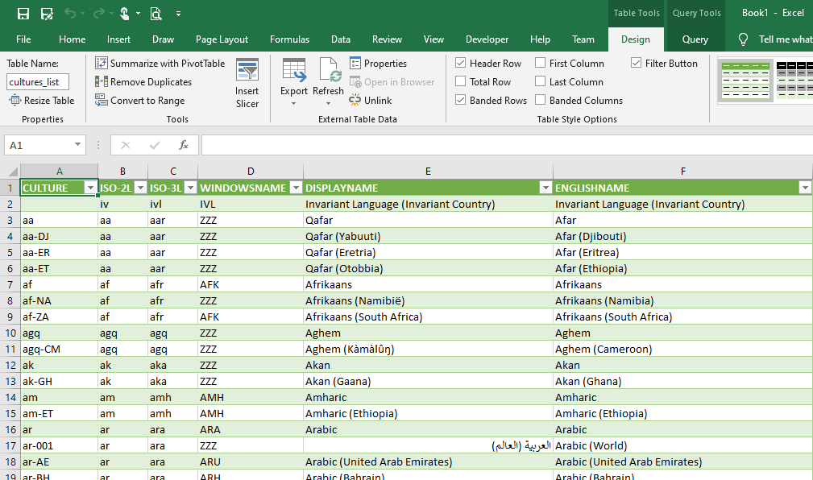

# DotNetAvailableCulturesInfo

Shows in console/terminal or saves to a CSV file the current system's available cultures information.


A .NET Core 3.1 app.

## Console output

If you run it from a console it will show all the information about the current supported cultures in the system:


There are more than 800 supported cultures in Windows 10, for example.

You'll get the culture name, the ISO 2 and 3 letter codes, the internal Windows name, the display name and the English name for each culture.

## CSV File output

You can use the `-o` or `/o`  switch and a file or path name to get the information as a CSV file. for example:

```bash
DotNetAvailableCulturesInfo.exe -o cultures-list.csv
```

You can then open it in Microsoft Excel, Google Sheets or any other CSV editing software.



Take into account that:

1. The generated file uses UTF-8 encoding and has **the UTF-8 BOM**. This enables Excel to recognize the correct encoding when opening the file.
2. **If non-English versions of Excel** the separator is not a comma (for example, in Spanish is a semicolon), so if you double-click on it, Excel won't be able to interpret it corectly. Just go to the `Data`  tab and use the button: `From Text/CSV`.
3. **The CSV file has all the headers in the first line**, but Excel ignores them by default. To use them as table headers just use the `Use First Row as Headers` button in the Power Query editor, like shown [here](https://cdn.jsdelivr.net/gh/jmalarcon/DotNetAvailableCultureInfo/imgs/excel-fix-headers.mp4).

Google Sheet imports the CSV flawlessly.

## Releases

There are 2 versions of the app in the "Releases" section of this repo:

- **`DotNetAvailableCulturesInfo-portable.zip`**: the minimum size version. Works in Windows, macOS and Linux. You'll need the .NET Core 3.1 runtime for it to work.
- **`DotNetAvailableCulturesInfo-XXXX-x64.zip`**: where XXXX is your favorite operating system (Windows, Linux or macOS). Its a compiled version of the tool with the minimum runtime included. You can simply download it and run it, because it has everything needed in the ZIP.

Hope it helps!